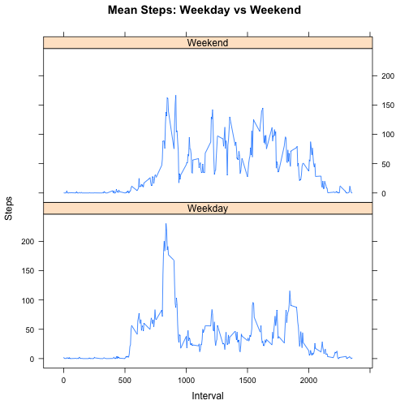

This is an R Markdown document for an analysis describing data from an activity tracker for an individual collected during the months of October and November, 2012

Read in the data

```r
data<-read.csv("activity.csv")
```

Processing to arrive at summary data and calculate total number of steps per day


```r
Total.aggdata <- aggregate(data$steps, by=list(data$date), FUN=sum)

names(Total.aggdata)[names(Total.aggdata)=="Group.1"] <- "Day"
names(Total.aggdata)[names(Total.aggdata)=="x"] <- "Total.Steps"
```

Histogram of total steps per day

```r
hist(Total.aggdata$Total.Steps, xlab="Total Steps", 
     main="Steps per Day")
```

 

Calculate and report mean and median for total number of steps per day. 
Mean is

```r
mean(Total.aggdata$Total.Steps, na.rm=TRUE)
```

```
## [1] 10766
```
Median is

```r
median(Total.aggdata$Total.Steps, na.rm=TRUE)
```

```
## [1] 10765
```

Find mean steps taken for each interval and create time series line plot

```r
Mean.int.aggdata <- aggregate(data$steps, by=list(data$interval), FUN=mean, na.rm=TRUE)
names(Mean.int.aggdata)[names(Mean.int.aggdata)=="Group.1"] <- "Interval"
names(Mean.int.aggdata)[names(Mean.int.aggdata)=="x"] <- "Mean.Steps"
plot(Mean.int.aggdata$Interval, Mean.int.aggdata$Mean.Steps, type="l",  ylab="Mean Steps" , 
     xlab="Interval",main="Mean Steps per Interval")
```

 


The 5-minute interval, on average across all the days in the dataset, which contains the maximum number of steps is:

```
## [1] 835
```

The total number of rows in the source data with missing values is:

```
## [1] 2304
```
Replace the NA value for steps with the average for that interval

```r
notmissing <- subset(data, !is.na(data$steps))
missing <- subset(data, is.na(data$steps))
missing<-merge(missing, Mean.int.aggdata, by.x="interval", by.y="Interval", all.x=TRUE)
missing$steps<- missing$Mean.Steps
missing <- subset(missing, select = -c(Mean.Steps) )

imputed<-rbind(missing, notmissing)
```

Create histogram of total steps per day of imputed data

```r
Imputed.Total.aggdata <- aggregate(imputed$steps, by=list(imputed$date), FUN=sum)

names(Imputed.Total.aggdata)[names(Imputed.Total.aggdata)=="Group.1"] <- "Day"
names(Imputed.Total.aggdata)[names(Imputed.Total.aggdata)=="x"] <- "Total.Steps"

hist(Imputed.Total.aggdata$Total.Steps, xlab="Total Steps", 
     main="Steps per Day for Imputed Data")
```

 


Calculate and report mean and median for total number of steps per day for the inputed data. 
Mean is

```r
mean(Imputed.Total.aggdata$Total.Steps, na.rm=TRUE)
```

```
## [1] 10766
```
Median is

```r
median(Imputed.Total.aggdata$Total.Steps, na.rm=TRUE)
```

```
## [1] 10766
```
The difference between the mean and median for total steps per day is small.
The numerical difference betwen the means is (original-imputed):

```r
mean(Total.aggdata$Total.Steps, na.rm=TRUE)-mean(Imputed.Total.aggdata$Total.Steps, na.rm=TRUE)
```

```
## [1] 0
```
The numerical difference betwen the medians is (original-imputed):


```r
median(Total.aggdata$Total.Steps, na.rm=TRUE)-median(Imputed.Total.aggdata$Total.Steps, na.rm=TRUE)
```

```
## [1] -1.189
```
Create a new factor variable in the dataset with two levels – “weekday” and “weekend” 

```r
imputed$dayofweek <- weekdays(as.Date(imputed$date))
imputed$isweekday<-ifelse(imputed$dayofweek=="Saturday"|imputed$dayofweek=="Sunday", 
                          "Weekend", "Weekday")
```
Make a panel plot containing a time series plot of the 5-minute interval and the average number of steps taken, averaged across all weekday days or weekend days. 

```r
Mean.int.aggdata <- aggregate(imputed$steps, by=list(imputed$interval, imputed$isweekday), FUN=mean, na.rm=TRUE)
names(Mean.int.aggdata)[names(Mean.int.aggdata)=="Group.1"] <- "Interval"
names(Mean.int.aggdata)[names(Mean.int.aggdata)=="Group.2"] <- "IsWeekday"
names(Mean.int.aggdata)[names(Mean.int.aggdata)=="x"] <- "Mean.Steps"

library(lattice)
xyplot(Mean.int.aggdata$Mean.Steps~Mean.int.aggdata$Interval |Mean.int.aggdata$IsWeekday,
       type="l", data=imputed, layout=c(1,2),
        main="Mean Steps: Weekday vs Weekend",
        xlab="Interval",
        ylab="Steps" )
```

 
